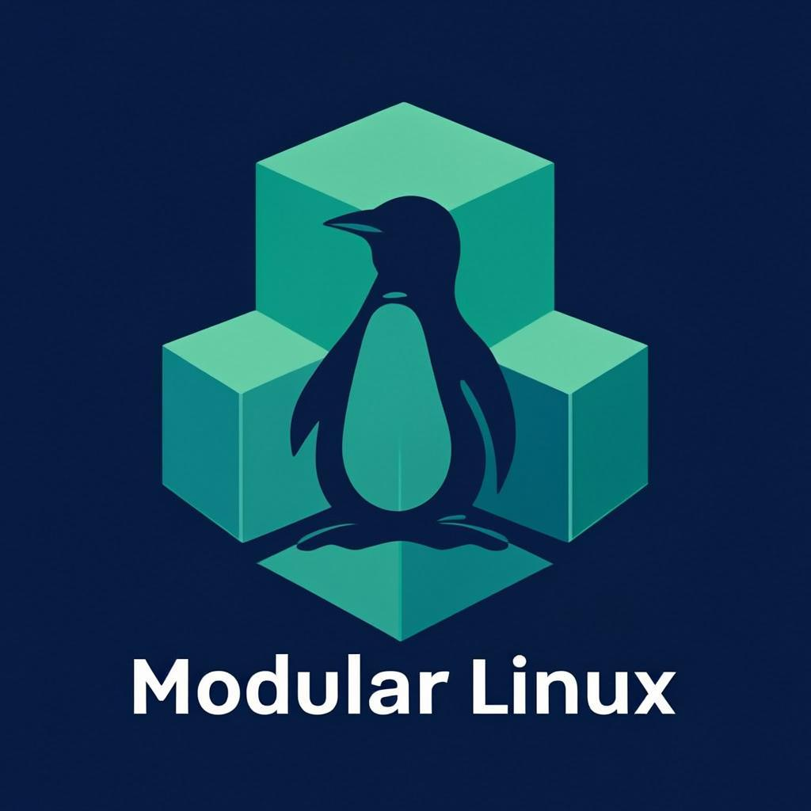

<p align="center">
  
</p>

# Modular Linux

[](https://github.com/sharathDHD/modular-linux/actions/workflows/ci.yml)
[](LICENSE)
[](https://www.python.org)
[](profiles/)
[](tests/)

**Modular Linux is an Arch-based modular Linux system builder, not a
replacement distribution.** It provides a bootable ISO and a graphical
system builder that installs only what the user selects: hardware support,
desktop environments or window managers, applications, development
environments, services, and system roles.

> Build the Linux system the user actually wants instead of installing a
> generic system and removing everything they do not want.

**Current status (v0.2.1):** Arch Linux on x86_64 with systemd. The
graphical installer and the `modular install <modular.yaml>` CLI both
drive the same Python orchestrator (`installer/installation/orchestrator.py`)
so configuration-based reproduction is fully supported. v0.2.1 fixes the
install execution path (partitioning script delivery, password stdin,
fstab generation, systemd-boot loader entries, mkinitcpio preset flag)
and adds execution-layer regression tests. Other base distributions,
ARM64 ISO builds, and alternate init systems are tracked in the roadmap
but not yet implemented in the install executor.

## Project status

| | |
|---|---|
| Base | Arch Linux, x86_64, systemd |
| Profiles | 116 (hardware / desktop / applications / services / roles) |
| Tests | 102 — engine + execution-layer (mocked executor) |
| Works | plan generation & validation, live ISO, GUI builder, config-driven install |
| Planned | other base distributions, ARM64, alternate init systems |

The engine and planning layers are well-tested; the execution layer is
young and regressed twice before it got its own test suite — treat real
installs as experimental until you have boot-tested one in QEMU
(`./build.sh --test`).

## Repository Layout

```text
modular-linux/
├── build.sh            one-command ISO build -> dist/modular-linux-arch-x86_64.iso
├── Makefile            builds bin/ (C hardware prober + Go CLI)
├── iso/                archiso profile (live environment)
├── installer/          Python + GTK3 graphical installer
│   ├── installation/   headless orchestrator (cli + GUI both use it)
│   ├── hardware/       detection (Python + C binary)
│   ├── storage/        partitioning helpers
│   └── ui/             GTK3 system builder
├── engine/             profile engine, resolver, validation (Python)
├── cli/                Python CLI fallback (python -m cli)
├── cmd/modular/        Go CLI -> bin/modular (static binary)
├── hardware/           C sysfs prober -> bin/modular-detect (JSON out)
├── profiles/           YAML catalog: desktops, WMs, GPU, roles, apps
├── schema/             modular.schema.yaml (v1 config schema)
├── examples/           shareable modular.yaml configs
├── scripts/            setup-dev.sh, build-iso.sh, test-vm.sh, validators
└── tests/              pytest suites (engine/hardware/installation/profiles)
```

## Quick Start

```bash
# one-time dev setup (Arch/EndeavourOS): toolchains + venv + tests
scripts/setup-dev.sh

source .venv/bin/activate

make                                       # builds bin/modular + bin/modular-detect
./bin/modular list roles                   # general/developer/gaming/server/...
./bin/modular list desktops                # 9 DEs + 7 window managers
./bin/modular resolve kde firefox audio    # resolution demo
python -m cli generate-plan examples/developer-workstation.yaml

# graphical system builder (needs a display; Xvfb works headless)
python installer/main.py

# headless configuration-driven install
MODULAR_INSTALL_DEVICE=/dev/sda \
MODULAR_INSTALL_PASSWORD=secret \
./bin/modular install examples/developer-workstation.yaml
```

## Configuration Example (v1)

```yaml
version: 1
base: {distribution: arch}
system: {architecture: x86_64, kernel: linux, init: systemd}
desktop: {environment: kde}
hardware: {network: true, wifi: true, bluetooth: true, audio: true,
           webcam: true, gpu: automatic}
roles: [developer]
applications: [firefox, git]
shell: {type: bash}
filesystem: {type: ext4}
bootloader: {type: systemd-boot}
sources: {arch: true, aur: false, flatpak: false, appimage: false}
```

After installation the system exports its configuration to
`/etc/modular/modular.yaml` — the primary representation of the installed
system and a portable recipe for reproducing it elsewhere.

## Building the ISO

```bash
./build.sh               # dist/modular-linux-arch-x86_64.iso
./build.sh --clean       # wipe work dirs + dist first
./build.sh --debug       # verbose mkarchiso
./build.sh --test        # build then boot in QEMU/KVM (UEFI)
```

Requires `archiso`, `qemu-desktop` and `edk2-ovmf` (installed by
`scripts/setup-dev.sh`).

## Trust Model

Package sources are explicit. Official Arch repositories are trusted;
AUR, Flatpak and AppImage sources are third-party, must be enabled
explicitly in the UI or configuration, and are flagged in the plan.

See `docs/architecture.md` for the component map and language policy.

## Participating

- [CHANGELOG.md](CHANGELOG.md) — what shipped in each version
- [CONTRIBUTING.md](CONTRIBUTING.md) — layering rules, profile authoring,
  how to run the test suite
- Bug reports: use the template and attach `/var/log/modular/install.log`
  from the live ISO
